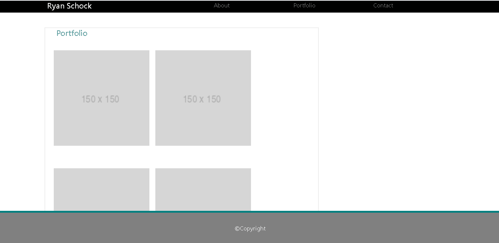
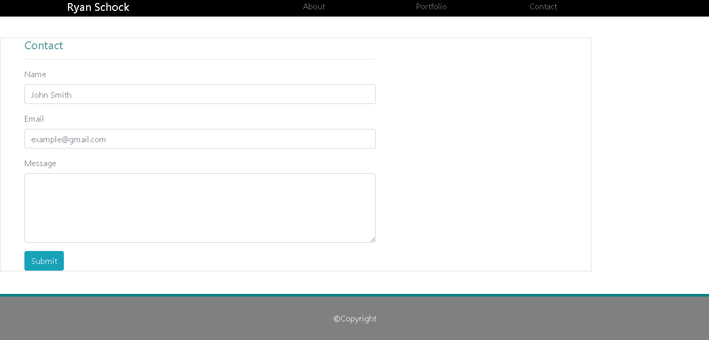

# ryan_s_homework_2

Second homework assignment for the Carleton Coding Boot Camp

This is a responsive portfolio, built with:

Bootstrap
HTML
CSS

It utilizes media queries to be responsive to various screen sizes

Currently I am using placeholder images in the "about" and "portfolio" section, but will update with a profile picture/screen shots of projects as the course comes to completion.

You can visit the live version here - https://ryanjms.github.io/ryan_s_homework_2/

Screenshots:
About (index.html)
![about] (images/about.png)
Portfolio (portfolio.html)

Contact (contact.html)

